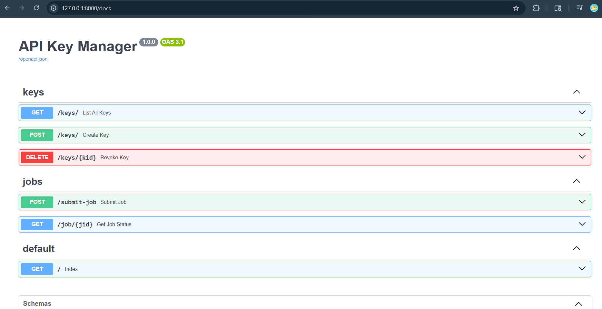
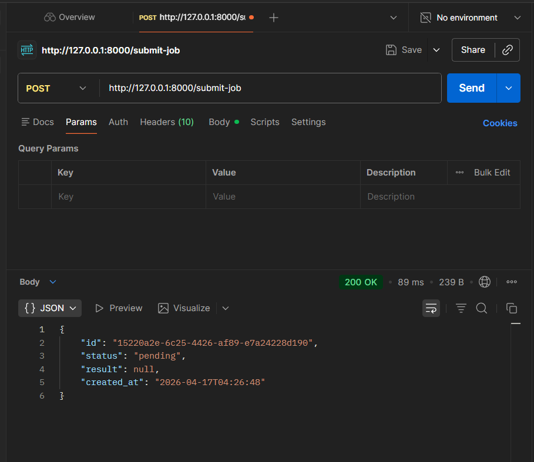

# BackendAssignment

Built this for the backend assignment. It handles API key generation, rate limiting per key, and running background jobs.

---

## What's in here

- create/list/revoke API keys
- validate keys via `X-API-Key` header
- rate limiting — 10 req/min per key, returns 429 if exceeded
- submit jobs that run in background (status goes pending → running → done)
- check job status anytime via GET

---

## Stack

- FastAPI
- SQLAlchemy + SQLite
- Pydantic v2
- Uvicorn

went with sqlite because it needs zero setup. swapping to postgres is just changing the DATABASE_URL env var, nothing else changes.

---

## How to run

```bash
pip install -r requirements.txt
uvicorn app.main:app --reload
```

db file (`myapp.db`) gets created automatically on first run.

swagger docs at: `http://localhost:8000/docs`

---
## 📸 Screenshots

### Swagger API Docs


---

### Postman Testing

## Endpoints

### POST /keys/
create a new api key

```json
{ "name": "my-service" }
```

returns the `raw_key` — only shown once, save it somewhere

---

### GET /keys/
list all keys with usage count

---

### DELETE /keys/{id}
revoke a key

---

### POST /submit-job
needs `X-API-Key` header

```json
{ "payload": "do something" }
```

returns job id with status `pending`. job runs in background, takes ~3 seconds.

returns 429 if you've hit the rate limit (10/min)

---

### GET /job/{id}
check job status — `pending`, `running`, `done`, or `failed`

---

## Design stuff

**why sha256 and not bcrypt**
api keys are random uuids, not user passwords. bcrypt is meant for slow hashing of predictable inputs. sha256 is fine here.

**why in-memory rate limiting**
kept it simple with a dict of timestamps. works for single server. if we needed multiple instances, redis would be the move. added a TODO in the code.

**why BackgroundTasks not Celery**
celery needs a broker and a separate worker process. way too much setup for what's basically a sleep(3). BackgroundTasks does the job.

---

## Known issues / limitations

- rate limiter resets on server restart
- /keys/ endpoints have no auth (anyone can create keys)
- no pagination
- background tasks die if server crashes mid-job

---

## what i'd do differently with more time

- redis for rate limiting
- alembic migrations
- protect the /keys/ routes with some admin token
- write actual tests
- maybe dockerize it
